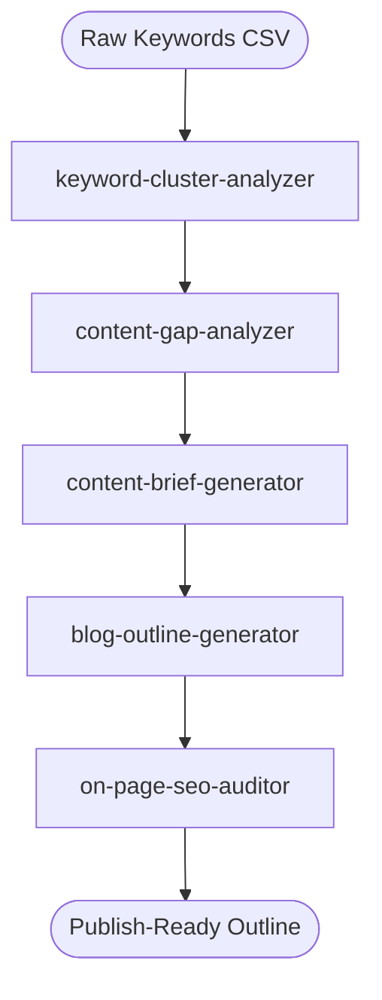
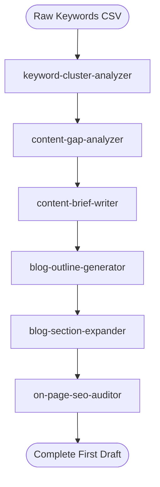
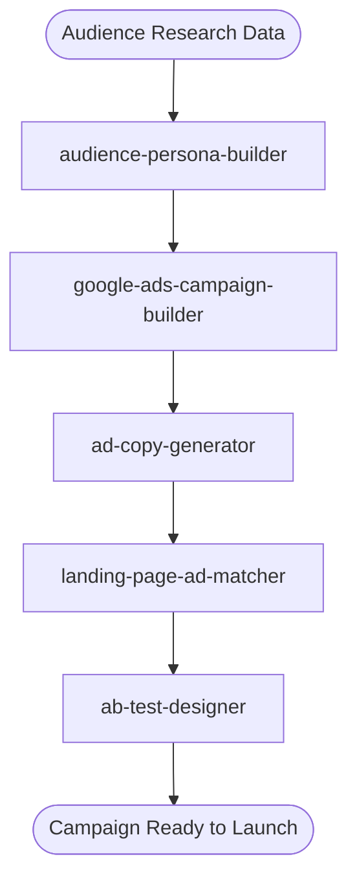
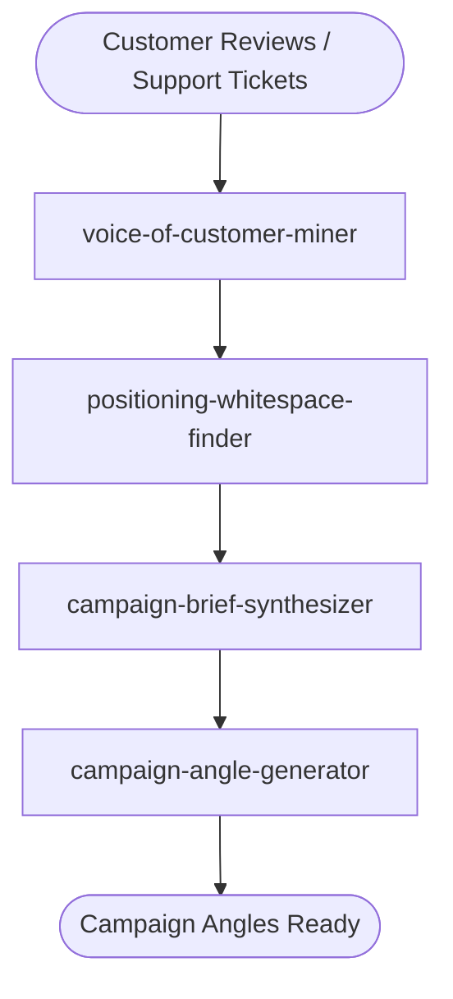

# Workflow Chains: The Power of Skill Chaining

> **The power isn't in any single skill. It's in the chain.**
>
> When you run Customer Persona Builder alone, you get 2 personas. When you chain it with Content Gap Analyzer → Blog Outline Generator → Social Content Calendar, you go from "here's who our customers are" to "here's our content roadmap + social strategy." That's the difference between a report and a revenue machine.

---

## How Chaining Works

Every skill in this collection follows a universal interface: **CSV in → Markdown out.** That means the output of one skill can feed directly into the next. No APIs, no integrations, no developer needed.

```
┌─────────────────┐     ┌──────────────────┐     ┌─────────────────┐
│  Skill A         │     │  Skill B          │     │  Skill C         │
│                  │     │                   │     │                  │
│  Your CSV  ───► │────►│  A's output  ───► │────►│  B's output ───► │──► Final
│  export         │     │  becomes B's      │     │  becomes C's     │    deliverable
│                 │     │  input            │     │  input           │
└─────────────────┘     └──────────────────┘     └─────────────────┘
```

**Three rules of chaining:**

1. **Start with data.** Export a CSV from your marketing tool. That's always Step 1.
2. **Each skill makes one decision.** The output answers one question clearly enough to feed the next skill.
3. **Every skill suggests what comes next.** Look for the `## Related Skills` section at the bottom — it tells you the 2-4 natural next steps.

---

## Pre-Built Workflow Chains

We've built 4 production-ready chains with detailed state-machine docs, Mermaid diagrams, decision gates, and handoff specs. These aren't just lists — they're complete playbooks with error handling and branching logic.

---

### 1. SEO Content Flywheel
**Time:** 2-3 hours · **Skills:** 5 · [Full workflow →](workflows/seo-content-flywheel.md)

Takes you from raw keywords to a publish-ready blog outline.

| Step | Skill | What It Does | Time |
|------|-------|-------------|------|
| 1 | [keyword-cluster-analyzer](skills/seo/keyword-cluster-analyzer.md) | Groups raw keywords into topic clusters | 15 min |
| 2 | [content-gap-analyzer](skills/content/content-gap-analyzer.md) | Finds gaps competitors rank for that you don't | 20 min |
| 3 | [content-brief-generator](skills/seo/content-brief-generator.md) | Creates SEO-optimized content briefs | 20 min |
| 4 | [blog-outline-generator](skills/content/blog-outline-generator.md) | Structures the post with H2s, H3s, word counts | 15 min |
| 5 | [on-page-seo-auditor](skills/seo/on-page-seo-auditor.md) | Final SEO check before publishing | 10 min |

**What you end up with:** A publish-ready blog post outline, fully optimized for search, targeting a gap your competitors missed.



---

### 2. Content Engine
**Time:** 3-4 hours · **Skills:** 6 · [Full workflow →](workflows/content-engine.md)

The expanded version of the SEO Flywheel — goes all the way from keyword research to a complete first draft.

| Step | Skill | What It Does | Time |
|------|-------|-------------|------|
| 1 | [keyword-cluster-analyzer](skills/seo/keyword-cluster-analyzer.md) | Clusters keywords into content pillars | 15 min |
| 2 | [content-gap-analyzer](skills/content/content-gap-analyzer.md) | Identifies which pillars to prioritize | 20 min |
| 3 | [content-brief-writer](skills/content/content-brief-writer.md) | Creates detailed briefs with audience, angle, CTA | 20 min |
| 4 | [blog-outline-generator](skills/content/blog-outline-generator.md) | Structures each piece | 15 min |
| 5 | [blog-section-expander](skills/content/blog-section-expander.md) | Expands outline into full draft sections | 30 min |
| 6 | [on-page-seo-auditor](skills/seo/on-page-seo-auditor.md) | Final optimization pass | 10 min |

**What you end up with:** A complete first draft of an SEO-optimized blog post, from keyword research to full copy.



---

### 3. Paid Acquisition
**Time:** 3-4 hours · **Skills:** 5 · [Full workflow →](workflows/paid-acquisition.md)

End-to-end paid campaign launch from audience definition through ad copy and landing page alignment.

| Step | Skill | What It Does | Time |
|------|-------|-------------|------|
| 1 | [audience-persona-builder](skills/insights/audience-persona-builder.md) | Defines target audiences from research data | 20 min |
| 2 | [google-ads-campaign-builder](skills/ads/google-ads-campaign-builder.md) | Structures campaigns, ad groups, keywords | 25 min |
| 3 | [ad-copy-generator](skills/ads/ad-copy-generator.md) | Writes ad variations per audience segment | 20 min |
| 4 | [landing-page-ad-matcher](skills/ads/landing-page-ad-matcher.md) | Audits landing page ↔ ad message alignment | 15 min |
| 5 | [ab-test-designer](skills/cro/ab-test-designer.md) | Designs the test plan for landing pages | 15 min |

**What you end up with:** A ready-to-launch paid campaign with audience targeting, ad copy, aligned landing pages, and a test plan.



---

### 4. Brand Positioning
**Time:** 3-4 hours · **Skills:** 4 · [Full workflow →](workflows/brand-positioning.md)

Builds defensible brand positioning from customer data — not guesswork.

| Step | Skill | What It Does | Time |
|------|-------|-------------|------|
| 1 | [voice-of-customer-miner](skills/insights/voice-of-customer-miner.md) | Extracts themes from reviews, forums, support tickets | 30 min |
| 2 | [positioning-whitespace-finder](skills/insights/positioning-whitespace-finder.md) | Maps competitive landscape, finds unclaimed positions | 25 min |
| 3 | [campaign-brief-synthesizer](skills/content/campaign-brief-synthesizer.md) | Synthesizes positioning into campaign briefs | 20 min |
| 4 | [campaign-angle-generator](skills/growth/campaign-angle-generator.md) | Generates 10-15 campaign angles from your positioning | 20 min |

**What you end up with:** Defensible brand positioning backed by customer data, with concrete campaign angles ready to execute.



---

## A Real Chain in Action

Here's what chaining actually looks like, from [Case Study 1](SHOWCASE.md#case-study-1-from-zero-to-content-pipeline-in-one-afternoon) — a SaaS founder building a content strategy:

```
Step 1: Customer Persona Builder
  Input:  → 847 rows from CRM export
  Output: → 2 personas with pain points, language patterns, content preferences

Step 2: Content Gap Analyzer
  Input:  → Persona insights + competitor URLs
  Output: → 23 content gaps ranked by opportunity score

Step 3: Blog Outline Generator
  Input:  → Top 5 gaps + persona data
  Output: → 5 detailed outlines with H2/H3 structure

Step 4: Social Content Calendar
  Input:  → Blog outlines + platform preferences
  Output: → 30-day calendar with 47 posts across 3 platforms

Step 5: Content Performance Scorecard
  Input:  → Published content URLs (run 30 days later)
  Output: → Performance report with recommendations for next quarter
```

**Total time:** 90 minutes. **Typical agency cost for this work:** $5,000-$15,000.

See all three case studies with sample CSV data and outputs → [SHOWCASE.md](SHOWCASE.md)

---

## Build Your Own Chain

Not every marketing problem has a pre-built chain. Here's how to design your own in 5 steps.

### Step 1: Start with the Outcome

Don't start with skills. Start with the question: **"What deliverable do I need at the end?"**

Examples:
- "I need a content calendar for Q3" → your end skill is `editorial-calendar-builder`
- "I need to prove marketing ROI to my CEO" → your end skill is `marketing-mix-modeler`
- "I need to fix our email program" → your end skill is `email-ab-testing-framework`

### Step 2: Work Backward

From your target deliverable, ask: **"What input does this skill need that I don't have?"**

That missing input is your previous step. Keep asking until you reach raw data you already have (a CSV export, a spreadsheet, survey responses).

**Example — working backward from `email-ab-testing-framework`:**

```
I need: A/B test plan for email
  └── Requires: Segmented audience lists
        └── email-list-segmentation needs: engagement data + deliverability status
              └── email-deliverability-auditor needs: email performance data
                    └── email-performance-analyzer needs: Your ESP export (CSV)
                          └── ✅ I have this!
```

Reading bottom-up, your chain is: `email-performance-analyzer → email-deliverability-auditor → email-list-segmentation → email-ab-testing-framework`

### Step 3: Check Related Skills

Every skill has a `## Related Skills` section at the bottom. This is your built-in chaining map — it suggests the 2-4 most natural next steps. Browse these to discover chains you hadn't considered.

### Step 4: Keep It Under 6

The best chains are 3-5 skills. If you're chaining 7+, you're probably trying to solve two problems — split into two chains.

### Step 5: Ask the Router

Not sure where to start? Tell the [Skill Router](skills/router/SKILL.md) what you're trying to accomplish:

> "My email open rates dropped 20% this quarter"

It will recommend a chain with execution order, time estimates, and the data you need for each step.

---

## Chaining Quick Reference

| I want to... | Start here → | Chain through → | End with |
|---|---|---|---|
| Build a content pipeline | keyword-cluster-analyzer | content-gap-analyzer → content-brief-writer | blog-outline-generator |
| Launch paid campaigns | audience-persona-builder | google-ads-campaign-builder → ad-copy-generator | landing-page-ad-matcher |
| Fix my email program | email-performance-analyzer | email-deliverability-auditor → email-list-segmentation | email-ab-testing-framework |
| Position my brand | voice-of-customer-miner | positioning-whitespace-finder → campaign-brief-synthesizer | campaign-angle-generator |
| Prove marketing ROI | attribution-model-builder | channel-mix-optimizer → budget-variance-analyzer | marketing-mix-modeler |
| Fix conversion rates | funnel-drop-off-analyzer | heatmap-analysis-toolkit → cta-optimization-framework | ab-test-designer |
| Reduce churn | churn-prediction-framework | customer-segmentation-engine → email-sequence-builder | cohort-analysis-builder |
| Launch on YouTube | audience-persona-builder | video-script-writer → youtube-seo-optimizer | short-form-video-planner |
| Onboard new users | customer-journey-mapper | welcome-series-creator → email-copywriting-framework | email-automation-workflow |
| Beat competitors | competitor-messaging-tracker | seo-competitor-analysis → positioning-whitespace-finder | campaign-angle-generator |

These aren't pre-built chains — they're suggested starting points. Use the `## Related Skills` sections within each skill to discover your own connections.

---

*Built a chain that worked well? [Share it with the community →](https://github.com/CodeCoinCognitionLLC/awesome-martech-skills/discussions/new)*
