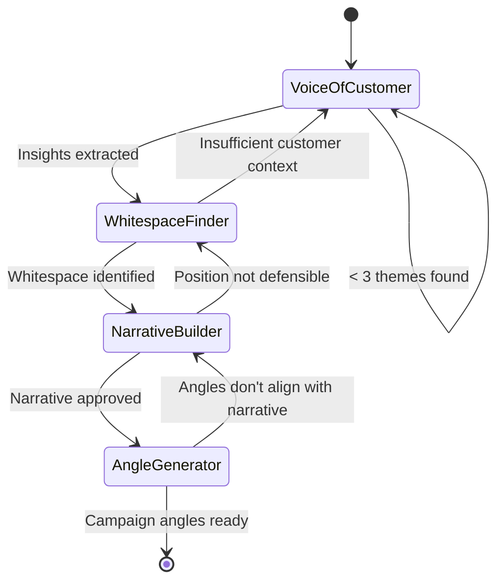

# Brand Positioning Workflow

A 4-step state machine that builds defensible brand positioning from customer data. Goes from raw voice-of-customer insights through competitive whitespace mapping to concrete campaign messaging you can use immediately.

## Workflow Overview



## Estimated Time

| Step | Skill | Time | Cumulative |
|---|---|---|---|
| 1 | voice-of-customer-miner | 15-20 min | 20 min |
| 2 | positioning-whitespace-finder | 10-15 min | 35 min |
| 3 | Human: narrative synthesis | 15-20 min | 55 min |
| 4 | campaign-angle-generator | 10 min | 65 min |
| **Total** | **3 skills + synthesis** | **~1 hour** | + human review |

## Step-by-Step Flow

### Step 1: Voice of Customer Mining

**Skill:** `voice-of-customer-miner`

**Input:** Target subreddits + keywords related to your product category, or customer survey data, interview transcripts, review exports

**Process:** Extract customer language, pain points, desires, objections, and decision criteria from real conversations

**Output:** Insight report with verbatim quotes + XLSX theme matrix

**Decision gate:**
- ✅ ≥5 strong themes with verbatim customer language → Proceed to Step 2
- ❌ <3 themes or themes are too generic → Expand data sources, add more subreddits/keywords, or conduct interviews
- ⚠️ Themes don't relate to your product → Adjust keyword focus to target your specific market segment

**Key outputs to carry forward:**
- Top 5 customer pain points (in their own words)
- Top 5 desired outcomes (in their own words)
- Decision criteria when choosing a solution
- Emotional language and metaphors customers use
- Objections and deal-breakers

**Handoff to Step 2:** Provide VoC theme matrix + your product description + 5+ competitor names. Tell positioning-whitespace-finder: "Analyze positioning whitespace using these customer insights as context."

---

### Step 2: Positioning Whitespace Mapping

**Skill:** `positioning-whitespace-finder`

**Input:** 5+ competitor descriptions/URLs + customer insights from Step 1

**Process:** Map competitors across positioning dimensions, identify saturated zones and whitespace opportunities, score opportunities by credibility and demand

**Output:** HTML positioning map + gap analysis with scored opportunities

**Decision gate:**
- ✅ ≥2 clear whitespace opportunities that align with customer demand (from Step 1) → Proceed to Step 3
- ❌ No whitespace found → Broaden competitor set, re-run with 5+ competitors, or look at sub-segments
- ⚠️ Whitespace exists but doesn't match customer demand → Return to Step 1 for deeper customer understanding
- ⚠️ Whitespace exists but you lack credibility → Note product gaps; position aspirationally with roadmap

**Key outputs to carry forward:**
- Top 2-3 whitespace positions
- Saturated messaging to avoid
- Positioning dimensions most relevant to market
- Competitor messaging to differentiate from

**Human checkpoint:** This is the most critical decision point. Review whitespace opportunities against:
1. Does our product credibly deliver this?
2. Do customers actually want this? (Check against Step 1)
3. Can competitors easily copy this position?
4. Does this align with our company vision?

Select ONE primary position to develop in Step 3.

---

### Step 3: Narrative Synthesis (Human + Claude)

**Process:** This step bridges positioning insight into a coherent brand narrative. It requires human judgment to select the right position and Claude's craft to articulate it.

**Input to Claude:** Selected whitespace position from Step 2 + customer language from Step 1

**Provide Claude with this prompt framework:**
```
Based on our positioning work:
- Our chosen whitespace: [selected position]
- Customer pain points: [top 3 from VoC]
- Customer desired outcomes: [top 3 from VoC]
- Customer language: [key phrases from VoC]
- Competitors to differentiate from: [top 3]

Build a brand narrative that includes:
1. The market problem (using customer language)
2. Why current solutions fail (referencing competitor gaps)
3. Our unique approach (the whitespace we own)
4. The transformation we deliver (customer outcomes)
5. Proof points (evidence we can offer)
```

**Output:** A 1-page narrative document with:
- Problem statement (customer language)
- Positioning statement (classic format: "For [audience] who [need], [product] is the [category] that [key benefit] unlike [competitors] because [reason to believe]")
- Message hierarchy: 1 primary message + 3 supporting messages
- Proof points per message

**Decision gate:**
- ✅ Narrative is clear, differentiated, and grounded in customer language → Proceed to Step 4
- ❌ Position isn't defensible → Return to Step 2 and select a different whitespace
- ⚠️ Narrative needs refinement → Iterate with Claude until it resonates

**Handoff to Step 4:** Provide the complete narrative document + customer context. Tell campaign-angle-generator: "Generate campaign angles based on this brand positioning narrative. Use these customer pain points as emotional fuel: [VoC data]."

---

### Step 4: Campaign Angle Generation

**Skill:** `campaign-angle-generator`

**Input:** Brand narrative from Step 3 + customer pain points from Step 1 + proof points

**Process:** Generate 15-20 campaign angles across 7 persuasion lenses (contrarian, data-driven, emotional, fear, aspirational, social proof, simplicity). Each angle must align with the approved positioning narrative.

**Output:** Angle library with hooks, arguments, evidence needs, and recommended formats

**Decision gate:**
- ✅ ≥10 strong angles that align with narrative → Workflow complete
- ❌ Angles don't align with approved positioning → Revise angles or revisit narrative (Step 3)
- ⚠️ Angles are good but proof points are weak → Flag content/evidence gaps for the marketing team

**Post-workflow actions:**
- Feed top angles into **hook-stress-tester** to evaluate headline variants
- Feed winning angles into **ad-copy-generator** for platform-specific copy
- Use angles in **email-sequence-builder** for nurture messaging
- Create content briefs (via **content-brief-generator**) around top angles

---

## Complete Example Walkthrough

**Scenario:** A project management SaaS for creative agencies needs to define their brand positioning.

1. **Voice of Customer Mining:**
   - Mined r/agencylife, r/creativedirectors, r/projectmanagement
   - Top pain: "We're constantly chasing clients for feedback" (142 mentions)
   - Top desire: "I want my team doing creative work, not admin work" (98 mentions)
   - Decision criteria: client communication, visual workflows, not "enterprise feeling"
   - Key phrase: "We're a creative shop, not a Fortune 500"

2. **Positioning Whitespace:**
   - Mapped against Monday.com, Asana, Basecamp, ClickUp, Teamwork
   - Saturated: "Easy for any team" (4 competitors here)
   - Whitespace found: **"Creative specialist + premium"** — no competitor specifically positions for creative agencies with a premium, craft-focused brand
   - Second option: "Simple + agency-specific" — possible but less differentiated

3. **Narrative Synthesis:**
   - Positioning statement: "For creative agencies frustrated by generic PM tools, ProjectFlow is the project management platform built exclusively for creative work — delivering client visibility, visual workflows, and team focus that generalist tools can't match."
   - Primary message: "Project management that speaks creative"
   - Supporting: (1) Client portals eliminate feedback chase, (2) Visual workflows match how creative teams think, (3) 34% fewer missed deadlines

4. **Campaign Angle Generation:**
   - Generated 18 angles. Top 5:
     - Contrarian: "Generic PM tools weren't built for creative work. Stop pretending they were."
     - Emotional: "Your designers spend 30% of their time on admin. That's talent waste."
     - Data-driven: "Agencies using ProjectFlow miss 34% fewer deadlines."
     - Aspirational: "Run the kind of agency people brag about working at."
     - Social proof: "500+ agencies switched from generic tools. Here's why."

**Result:** Complete positioning framework from customer truth → competitive whitespace → brand narrative → campaign-ready messaging.

## When to Use This Workflow

- Defining positioning for a new product/company
- Repositioning after market changes
- Entering a new market segment
- Post-acquisition brand integration
- Annual messaging refresh
- Pre-rebrand strategic foundation

## Tips for Best Results

1. **Don't skip Step 1:** Positioning without customer insight is guesswork. VoC data makes every subsequent step stronger.
2. **Be honest at Step 2:** If you can't credibly claim a whitespace position, don't. Aspirational positioning fails if the product doesn't deliver.
3. **Step 3 needs a human:** The narrative synthesis step is where strategic judgment matters most. Don't fully automate this — use Claude as a thinking partner.
4. **Test angles before committing:** Use Step 4 angles as ad experiments before baking them into brand identity.
5. **Revisit annually:** Markets shift, competitors reposition, customers evolve. Run this workflow at least once per year.
