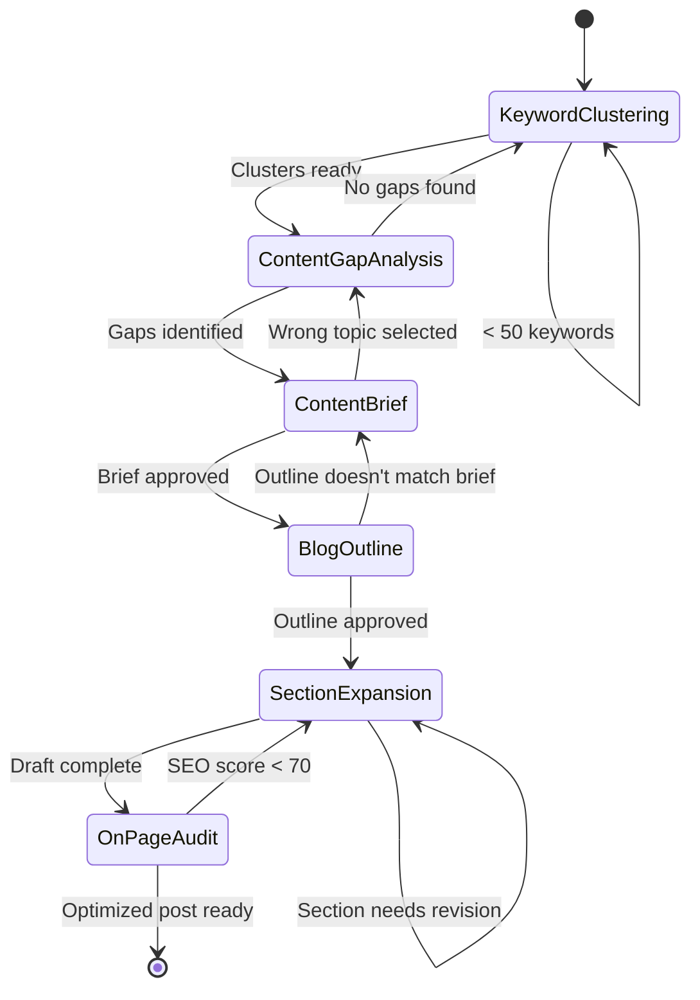

# Content Engine Workflow

A 6-step state machine that takes you from raw keyword research to a complete, SEO-optimized blog post ready for publication. Each step chains into the next with clear handoff specs and decision gates.

## Workflow Overview

## Estimated Time

| Step | Skill | Time | Cumulative |
|---|---|---|---|
| 1 | keyword-cluster-analyzer | 10 min | 10 min |
| 2 | content-gap-analyzer | 10 min | 20 min |
| 3 | content-brief-generator | 10 min | 30 min |
| 4 | blog-outline-generator | 10 min | 40 min |
| 5 | blog-section-expander (×5-8 sections) | 40-60 min | 1.5-2 hrs |
| 6 | on-page-seo-auditor | 10 min | 1.5-2 hrs |
| **Total** | **6 skills** | **1.5-2 hours of Claude time** | + human review |

## Step-by-Step Flow

### Step 1: Keyword Clustering

**Skill:** `keyword-cluster-analyzer`

**Input:** CSV of 50-500 keywords with search volume and difficulty

**Process:** Cluster keywords into topical groups with intent classification

**Output:** XLSX with clusters ranked by opportunity score

**Decision gate:**
- ✅ ≥5 meaningful clusters with search volume → Proceed to Step 2
- ❌ <50 keywords → Gather more keywords and re-run
- ⚠️ Clusters too broad → Split and re-cluster with more specific seed terms

**Handoff to Step 2:** Provide the cluster XLSX. Tell content-gap-analyzer: "Here are my keyword clusters. Compare against these competitors: [competitor URLs]"

---

### Step 2: Content Gap Analysis

**Skill:** `content-gap-analyzer`

**Input:** Keyword clusters from Step 1 + 3-5 competitor domains

**Process:** Compare your content coverage against competitors to find blind spots, weak areas, and uncontested opportunities

**Output:** XLSX gap analysis with prioritized action plan

**Decision gate:**
- ✅ ≥3 high-priority content gaps identified → Proceed to Step 3
- ❌ No meaningful gaps → Broaden competitor set or expand keyword research (loop to Step 1)
- ⚠️ All gaps are extremely high difficulty → Focus on uncontested/long-tail opportunities

**Handoff to Step 3:** Select the #1 priority gap. Tell content-brief-generator: "Create a content brief for [gap topic] targeting [primary keyword]. Here's the competitive context: [gap details]"

---

### Step 3: Content Brief Generation

**Skill:** `content-brief-generator`

**Input:** Selected gap topic + primary keyword + competitive context from Step 2

**Process:** Generate a comprehensive content brief with SERP analysis, content structure, SEO guidelines, and target metrics

**Output:** Markdown content brief

**Decision gate:**
- ✅ Brief covers the topic comprehensively and aligns with business goals → Proceed to Step 4
- ❌ Wrong topic selected or topic doesn't align with strategy → Return to Step 2, select different gap
- ⚠️ Brief needs adjustment → Revise brief before proceeding

**Human checkpoint:** Review the brief. Confirm target keyword, angle, audience, and competitive differentiation.

**Handoff to Step 4:** Provide the content brief. Tell blog-outline-generator: "Create an outline based on this content brief."

---

### Step 4: Blog Outline Generation

**Skill:** `blog-outline-generator`

**Input:** Content brief from Step 3

**Process:** Create a detailed H2/H3 outline with word count targets per section, key points, and internal link opportunities

**Output:** Markdown outline with section breakdown

**Decision gate:**
- ✅ Outline matches brief's structure and covers all required topics → Proceed to Step 5
- ❌ Outline doesn't match brief requirements → Revise outline (re-run Step 4)
- ⚠️ Outline has too many/few sections → Adjust scope and re-run

**Human checkpoint:** Review outline structure. Confirm section order, depth, and coverage.

**Handoff to Step 5:** Provide the approved outline. Start with section 1: "Expand the first section: '[H2 heading]' targeting '[keyword]'. Key points: [bullet points from outline]."

---

### Step 5: Section-by-Section Expansion

**Skill:** `blog-section-expander` (called iteratively)

**Input:** One section heading + key points + target keyword from the outline

**Process:** Expand each section into 300-500 words of polished, SEO-optimized copy

**Output:** Markdown section content

**Decision gate (per section):**
- ✅ Section meets quality standards → Move to next section
- ❌ Section needs revision → Provide feedback and re-expand
- ⚠️ Section is too thin/thick → Adjust word count target

**Iteration:** Repeat for all sections (typically 5-8). After all sections complete, assemble into full blog post.

**Human checkpoint:** Review complete assembled post for flow, consistency, and brand voice.

**Handoff to Step 6:** Provide the complete assembled blog post. Tell on-page-seo-auditor: "Audit this post for on-page SEO. Target keyword: [keyword]. Page type: blog post."

---

### Step 6: On-Page SEO Audit

**Skill:** `on-page-seo-auditor`

**Input:** Complete blog post content + target keyword

**Process:** Score the post across 8 SEO dimensions and provide specific fixes

**Output:** Scored audit report with rewritten elements

**Decision gate:**
- ✅ SEO score ≥70/100 → Post is ready for publication
- ❌ SEO score <70 → Apply fixes and re-audit (loop within Step 6)
- ⚠️ Critical issues found (missing meta, no schema) → Fix critical issues before publishing

**Final output:** Optimized blog post with SEO-ready title tag, meta description, heading structure, and schema markup.

---

## Complete Example Walkthrough

**Scenario:** An agency management SaaS wants to build their content engine.

1. **Keyword Clustering:** Upload 200 keywords about agency management → 12 clusters identified → Top cluster: "Agency Project Management" (8,400 monthly volume)

2. **Content Gap Analysis:** Compared against Monday.com, Asana, Teamwork → Blind spot found: "agency resource allocation" — competitors rank, user doesn't

3. **Content Brief:** Generated brief for "Resource Allocation for Agencies" targeting "agency resource allocation" (1,300 vol, 32 difficulty)

4. **Blog Outline:** Created 7-section outline covering resource allocation challenges, methods, tools, and implementation

5. **Section Expansion:** Expanded 7 sections → 2,800 words of polished copy with data points and examples

6. **SEO Audit:** Scored 78/100 → Fixed meta description (was missing) and improved H2 keyword placement → Final score: 86/100

**Result:** Publication-ready blog post targeting an uncontested keyword with 1,300 monthly searches.

## When to Use This Workflow

- Building a content program from scratch
- Quarterly content planning cycles
- Content sprint: produce 3-5 posts in a focused period
- New market or product line content strategy
- Content refresh: run Steps 5-6 on existing posts that need updating

## Tips for Best Results

1. **Batch Step 1-2:** Do keyword research and gap analysis for your entire quarter, then create individual briefs per post
2. **Parallelize Step 5:** Multiple sections can be expanded simultaneously if you have the context
3. **Skip steps when appropriate:** If you already have keywords, start at Step 2. If you have a brief, start at Step 4.
4. **Feed Step 6 back:** SEO audit findings should inform future content briefs (Step 3)
