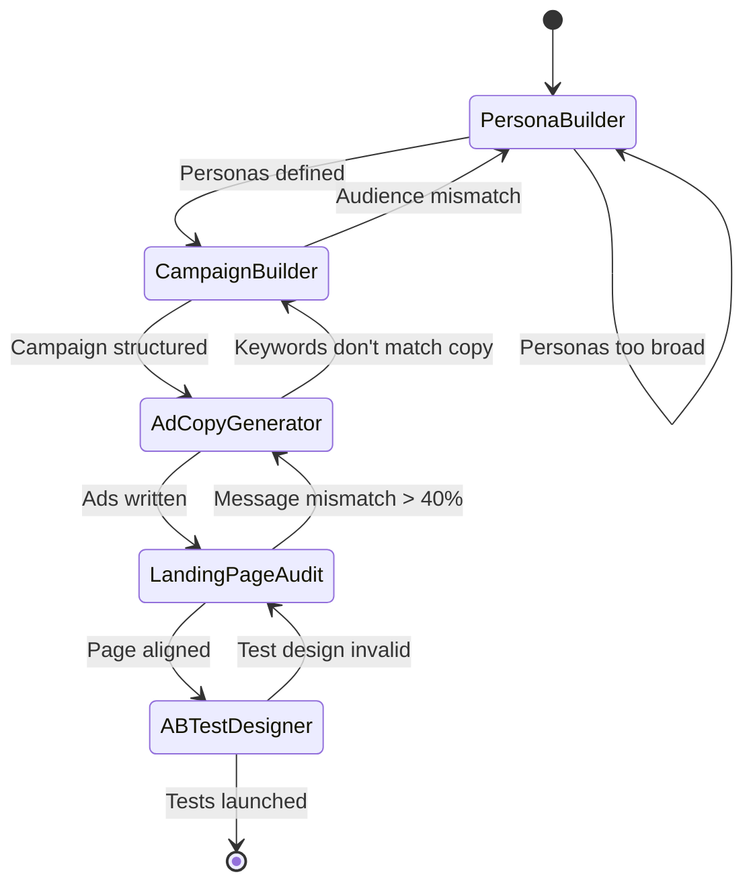

# Paid Acquisition Workflow

A 5-step state machine for launching high-converting paid acquisition campaigns. Takes you from audience definition through campaign structure, ad copy, landing page alignment, and A/B test design.

## Workflow Overview

## Estimated Time

| Step | Skill | Time | Cumulative |
|---|---|---|---|
| 1 | customer-persona-builder | 10-15 min | 15 min |
| 2 | google-ads-campaign-builder | 10-15 min | 30 min |
| 3 | ad-copy-generator | 10 min | 40 min |
| 4 | landing-page-ad-matcher | 10 min | 50 min |
| 5 | ab-test-designer | 10 min | 60 min |
| **Total** | **5 skills** | **~1 hour of Claude time** | + human review |

## Step-by-Step Flow

### Step 1: Audience & Persona Definition

**Skill:** `customer-persona-builder`

**Input:** Product description, target market, available customer data (survey CSV, interview notes, or audience description)

**Process:** Build 2-3 detailed buyer personas with demographics, psychographics, pain points, and buying journey

**Output:** Persona documents with targeting criteria

**Decision gate:**
- ✅ 2-3 distinct personas with clear targeting criteria → Proceed to Step 2
- ❌ Personas too broad or overlapping → Refine with more specific data
- ⚠️ Only 1 viable persona → Proceed but note limited audience segmentation

**Handoff to Step 2:** Provide persona documents. Tell google-ads-campaign-builder: "Build campaigns targeting these personas. Product: [product]. Budget: [budget]. Goal: [conversions/leads]."

---

### Step 2: Campaign Structure

**Skill:** `google-ads-campaign-builder`

**Input:** Personas from Step 1 + product details + budget + target keywords

**Process:** Structure campaign hierarchy — campaigns, ad groups, keywords with match types, negative keywords, bid strategy

**Output:** XLSX campaign structure (Google Ads Editor-ready)

**Decision gate:**
- ✅ Campaign structure covers all persona segments with appropriate keywords → Proceed to Step 3
- ❌ Keywords don't match persona intent → Return to Step 1 to refine personas or adjust keywords
- ⚠️ Budget insufficient for keyword volume → Narrow to highest-priority ad groups

**Handoff to Step 3:** Provide the campaign structure XLSX. Tell ad-copy-generator: "Write RSA ad copy for these ad groups. Target audience: [persona details]. Platform: Google Ads."

---

### Step 3: Ad Copy Creation

**Skill:** `ad-copy-generator`

**Input:** Ad groups and keywords from Step 2 + persona details from Step 1

**Process:** Generate RSA headlines (15 per ad), descriptions (4 per ad), and extensions. Create variants organized by persuasion angle (benefit, fear, social proof, urgency).

**Output:** Complete ad copy organized by ad group and angle

**Decision gate:**
- ✅ Ad copy aligns with keywords and persona pain points → Proceed to Step 4
- ❌ Copy doesn't match keyword intent (informational copy for transactional keywords) → Revise copy or revisit campaign structure
- ⚠️ Character limits exceeded → Trim and re-test for clarity

**Handoff to Step 4:** Provide top-performing ad copy per ad group + landing page content. Tell landing-page-ad-matcher: "Audit alignment between these ads and this landing page."

---

### Step 4: Landing Page Alignment

**Skill:** `landing-page-ad-matcher`

**Input:** Ad copy from Step 3 + landing page content (HTML or copy-paste)

**Process:** Score message alignment across 6 dimensions — headline continuity, keyword presence, value prop match, CTA alignment, emotional continuity, experience quality

**Output:** Alignment score + specific fixes with rewrites

**Decision gate:**
- ✅ Alignment score ≥75/100 → Proceed to Step 5
- ❌ Alignment score <60 or critical mismatches found → Fix landing page or revise ad copy (loop to Step 3)
- ⚠️ Score 60-74 → Apply recommended fixes, then proceed

**Human checkpoint:** Review landing page changes. Implement recommended headline, CTA, and copy adjustments before launching.

**Handoff to Step 5:** Provide the primary ad variant + aligned landing page. Tell ab-test-designer: "Design an A/B test for this landing page. Current conversion rate: [X%]. Traffic: [Y visitors/week]."

---

### Step 5: A/B Test Design

**Skill:** `ab-test-designer`

**Input:** Current landing page + ad performance data + conversion rate + traffic volume

**Process:** Design a statistically sound A/B test with hypothesis, sample size calculation, duration estimate, and success criteria

**Output:** Complete test plan with variant specifications

**Decision gate:**
- ✅ Test design is statistically valid (adequate sample size, reasonable duration) → Launch test
- ❌ Insufficient traffic for valid test within budget → Simplify test (fewer variants) or extend timeline
- ⚠️ Test requires >8 weeks → Consider sequential testing or focus on highest-impact element

**Final output:** A/B test plan ready for implementation in Google Optimize, Optimizely, VWO, or similar.

---

## Complete Example Walkthrough

**Scenario:** B2B SaaS launching Google Ads for a project management tool, $5,000/month budget.

1. **Persona Builder:** Created 2 personas — "Overwhelmed Team Lead" (25-35, manages 5-15 people, frustrated by Slack/spreadsheets chaos) and "Scaling Agency Owner" (35-50, agency growing past 20 people, needs client visibility)

2. **Campaign Builder:** Structured 2 campaigns with 5 ad groups each:
   - Campaign 1 (Team Lead): PM software general, task management, team collaboration, PM comparison, PM features
   - Campaign 2 (Agency): Agency PM, client project management, agency workflow, creative project management
   - 48 keywords total, 35 negatives, Max Conversions bidding

3. **Ad Copy Generator:** Created 10 RSA ads (5 per campaign):
   - Team Lead angles: "Stop managing projects in spreadsheets", "14-day free trial — no credit card"
   - Agency angles: "Built for agencies that deliver exceptional work", "Client portals + resource allocation"

4. **Landing Page Audit:** Scored 58/100 → Critical issues: page headline said "Work Management Platform" (too generic for specific ad copy). Fixed to "Project Management for Growing Teams" → re-scored 82/100

5. **A/B Test Design:** Designed headline test: "Project Management for Growing Teams" vs "The PM Tool Your Team Will Actually Use". Sample size: 1,200 per variant. Duration: 3 weeks at current traffic.

**Result:** Complete paid acquisition system ready to launch with structured campaigns, aligned messaging, and optimization framework.

## When to Use This Workflow

- Launching paid search from scratch
- Rebuilding underperforming campaigns
- Expanding to new audience segments
- Product launch paid promotion
- Quarterly campaign restructuring

## Tips for Best Results

1. **Start with data:** If you have existing campaign data, bring it — even poor performance data helps calibrate
2. **One persona per campaign:** Keep campaigns aligned with a single persona for clear messaging
3. **Test before scaling:** Don't increase budget until Step 5 validates your messaging
4. **Loop back:** After collecting 30+ conversions, re-run Step 2 with performance data to optimize structure
5. **Complement with content:** Run the content-engine workflow in parallel to build organic traffic alongside paid
