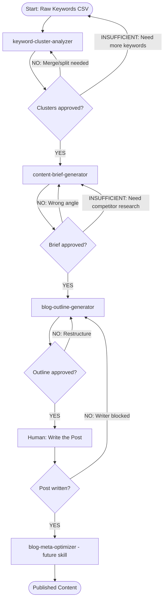

# SEO Content Flywheel

A state-machine workflow that chains 4 skills into a complete content creation pipeline: from raw keywords to a publish-ready blog outline.

## State Diagram

## Overview

| Step | Skill | Time | Input | Output |
|---|---|---|---|---|
| 1 | keyword-cluster-analyzer | 5-10 min | Keywords CSV | XLSX with clusters |
| 2 | content-brief-generator | 5-10 min | Primary keyword from cluster | Content brief (Markdown) |
| 3 | blog-outline-generator | 5-10 min | Content brief | Detailed outline (Markdown) |
| 4 | Human writing | 2-6 hours | Outline | Draft blog post |
| 5 | blog-meta-optimizer (future) | 5-10 min | Draft post | SEO-optimized meta + internal links |

**Total estimated time:** 3-7 hours (mostly human writing time)

---

## Step 1: Keyword Cluster Analyzer

### Input
- **Source:** CSV export from Ahrefs, SEMrush, or Google Keyword Planner
- **Minimum:** 10 keywords with search volume data
- **Format:** `keyword`, `search_volume`, `difficulty` columns

### What happens
The skill groups keywords by topical similarity and search intent, identifies a primary keyword per cluster, and ranks clusters by opportunity (high volume + low difficulty).

### Output → Handoff to Step 2
- **Pass forward:** The primary keyword from the highest-priority cluster
- **Also pass:** Secondary keywords from the same cluster
- **Keep for reference:** Full cluster XLSX for content planning

### Decision Gate

| Decision | Criteria | Action |
|---|---|---|
| **YES** — Clusters look right | 4-8 clusters, clear topics, sensible groupings | Proceed to Step 2 with top cluster |
| **NO** — Clusters need adjustment | Overlapping topics, missing obvious groups | Merge/split clusters and re-review |
| **INSUFFICIENT** — Too few keywords | <10 keywords or no clear clusters | Go back to START, export more keywords |

---

## Step 2: Content Brief Generator

### Input
- **From Step 1:** Primary keyword + secondary keywords from chosen cluster
- **Additional (optional):** Competitor URLs, target audience, brand context

### What happens
Creates a comprehensive writing brief with title options, SERP analysis (if web search available), content structure, word count targets, and SEO guidelines.

### Output → Handoff to Step 3
- **Pass forward:** Complete content brief (Markdown document)
- **Key data for Step 3:** Chosen title, target word count, H2 structure suggestions, keywords to include

### Decision Gate

| Decision | Criteria | Action |
|---|---|---|
| **YES** — Brief is solid | Clear angle, good structure, competitive positioning | Proceed to Step 3 |
| **NO** — Wrong angle | Brief doesn't match brand voice or strategy | Adjust angle/audience and regenerate |
| **INSUFFICIENT** — Need more research | Competitive landscape unclear | Run competitor URL analysis, then regenerate |

---

## Step 3: Blog Outline Generator

### Input
- **From Step 2:** Content brief (Markdown)
- **Additional (optional):** Content type preference, CTA goal, tone guidelines

### What happens
Expands the brief into a detailed section-by-section outline with H2/H3 hierarchy, key points per section, word count allocations, CTA placement, and internal linking spots.

### Output → Handoff to Step 4
- **Pass to writer:** Complete outline with section-level guidance
- **Include:** Word count targets per section, key points to cover, keywords to place, tone notes

### Decision Gate

| Decision | Criteria | Action |
|---|---|---|
| **YES** — Outline is ready | All sections make sense, flow is logical, word counts are realistic | Proceed to Step 4 (human writing) |
| **NO** — Structure issues | Missing sections, wrong emphasis, poor flow | Restructure and re-review |

---

## Step 4: Human Writing

### Input
- **From Step 3:** Detailed outline with section-level guidance

### What happens
A human writer (or the user) writes the blog post following the outline. This is the only step that requires significant human time.

### Writer's Handoff Package

The outline from Step 3 should include everything a writer needs:
- H2/H3 structure with key points
- Word count per section
- Keywords to include per section
- Tone and style guidelines
- Internal linking suggestions
- CTA copy and placement
- Sources/references to cite

### Decision Gate

| Decision | Criteria | Action |
|---|---|---|
| **YES** — Post is drafted | All sections written, word count met, keywords placed | Proceed to Step 5 |
| **NO** — Writer is blocked | Can't find angle, section feels off, needs research | Go back to Step 3 outline for that specific section |

---

## Step 5: Blog Meta Optimizer (Future Skill)

### Input
- **From Step 4:** Complete blog post draft (Markdown or HTML)
- **From Step 1:** Target keywords and cluster data

### What happens (planned)
Optimizes the meta layer: title tag, meta description, Open Graph tags, JSON-LD schema markup, internal link insertion, image alt text, and readability score.

### Output
- SEO-optimized meta tags
- Internal linking recommendations
- Schema markup code
- Readability analysis
- Final pre-publish checklist

---

## Example Walkthrough

**Scenario:** EcoBlend (sustainable beverage company) wants to create content around "sustainable packaging"

### Step 1 Output
> Clustered 45 keywords into 6 groups. Top cluster:
> - **Primary:** "sustainable packaging solutions" (2,400/mo, difficulty 35)
> - **Secondary:** "eco-friendly packaging materials", "biodegradable packaging for food", "sustainable packaging companies"
> - **Intent:** Commercial investigation

### Step 2 Output
> Content brief targeting "sustainable packaging solutions"
> - **Format:** Ultimate guide (2,500 words)
> - **Angle:** Practical comparison of packaging materials for food brands
> - **Title:** "Sustainable Packaging Solutions: The Complete Guide for Food Brands (2026)"

### Step 3 Output
> 7-section outline:
> 1. Why Sustainable Packaging Matters Now (~300 words)
> 2. 5 Types of Sustainable Packaging Materials (~600 words)
> 3. Cost Comparison: Sustainable vs. Traditional (~400 words)
> 4. How to Switch Packaging Without Breaking Your Budget (~400 words)
> 5. Case Studies: Brands That Made the Switch (~400 words)
> 6. Regulatory Requirements You Should Know (~200 words)
> 7. Next Steps: Getting Started (~200 words) [PRIMARY CTA]

### Step 4
> Writer completes the 2,500-word post following the outline.

### Step 5 (Future)
> Meta optimization adds title tag, meta description, schema markup, and 4 internal links.

---

## Tips for Running This Workflow

1. **Batch it:** Run Steps 1-3 for 5 clusters in one session, then hand all 5 outlines to writers simultaneously.

2. **Reuse clusters:** The keyword cluster output from Step 1 feeds multiple rounds of Steps 2-5. One keyword research session = months of content.

3. **Track performance:** After publishing, add the article URL and target keyword to a tracking sheet. Re-run the keyword cluster analyzer quarterly to find new opportunities.

4. **Iterate on briefs:** If a published article underperforms, re-run Step 2 with competitor URLs that are outranking you, then update the article.
